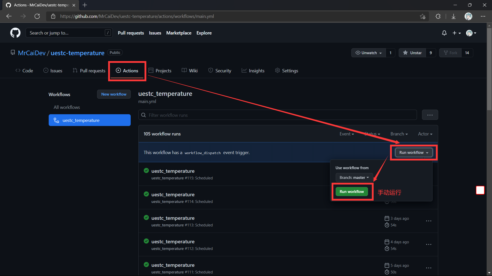

# uestc-temperature

> 关于我，欢迎关注：
>
> 个人博客：[mrcai.space](https://mrcai.space)
>
> Github 主页：[MrCaiDev](https://github.com/MrCaiDev)
>
> 个人邮箱：1014305148@qq.com
>
> 工作邮箱：yuwangcai@std.uestc.edu.cn

## 项目介绍

电子科技大学（UESTC）每日体温自动填报。

- 本项目仅适用于微信小程序**智慧学工→疫情防控**；
- 工作流将自动在每日的**01:30**发起上报，略有几分钟延迟为正常状况，全过程无需用户执行任何操作。
- 对代码改进有任何好的建议，欢迎提`Issues`，或者直接`PR`！
- 如果对您有帮助，请顺手点个⭐`Star`⭐吧~

## 使用方法

1. 抓取cookie。

   1. 先在手机上装[HttpCanary](http://a.downxy.com/anzhuo/httpcanary3.3.6_anfensi.com.apk)，并根据软件的提示授予权限、安装证书（后面的ROOT和教程可以直接跳过）；

   2. 进入微信小程序“智慧学工”下的“应用中心”；

   3. 返回HttpCanary，点击右下角按钮，开始抓包；

     

   4. 返回微信，进入“疫情防控”；

   5. 返回HttpCanary，找到这个包：

     <table><tr>
     <td></td>
     <td></td>
     </tr></table>

   6. 在“请求”一栏的最下方，就能找到你的cookie。我们需要的是`SESSION=xxxxxxxx-xxxx-xxxx-xxxx-xxxxxxxxxxxx`那一段，后面的不管。复制下来，待会要用到。

     

2. 部署Action。

   1. 将本仓库`Fork`到自己的仓库里；

    

   2. 点击`Settings`→`Secrets`→`New repository secret`。

    

   3. 在`Name`中填入`COOKIES`，在`Value`中填入刚刚记录的cookie；如果有多个人的cookie，就用`#`隔开。最后点击`Add Secret`。

    

   4. 完成后，进入`Actions`界面。工作流默认会自动开启，但也请人工复查防止意外。你也可以手动执行工作流，检验程序能否执行。

    

## TODO

1. 支持当前不在校学生的填报。
2. 支持研究生网上平台的填报。

## 注意事项

- 本项目仅供学习参考之用，如果因为本项目导致意外情况的发生（几率极小），本项目及其作者不承担相应责任。
- 目前发现Cookie可能会过期，保质期未知！
